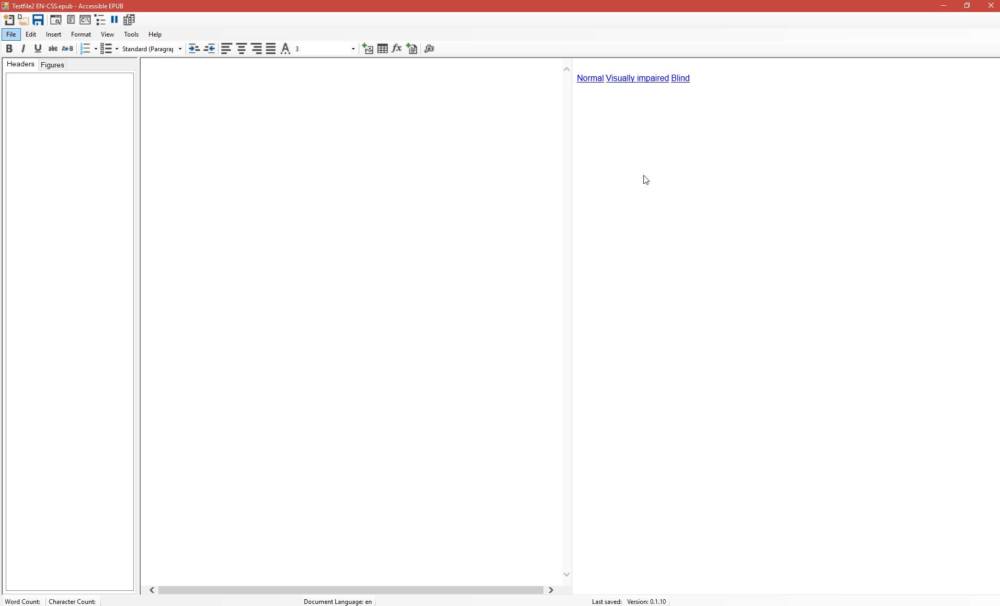
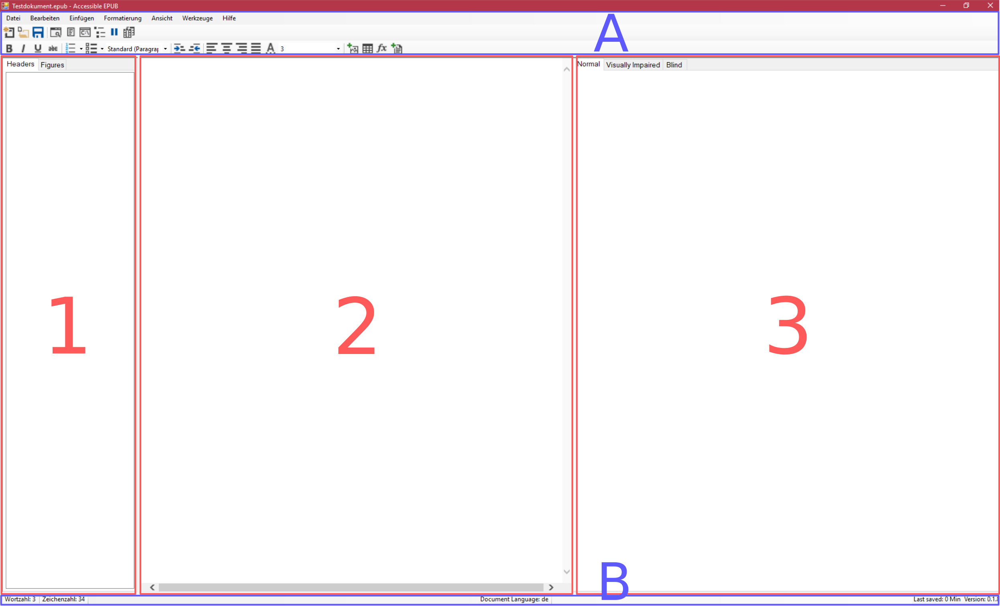

<u>Fortschrittsübersicht:</u>

| Abschnitt          | Inhalt skizziert   | Inhalt abgeschlossen | Korrekturgelesen | Feinschliff |
| ------------------ | ------------------ | -------------------- | ---------------- | ----------- |
| 1 (Einführung)     | :heavy_check_mark: | :x:                  | :x:              | :x:         |
| 2 (Bearbeitung)    |                    |                      |                  |             |
|                    |                    |                      |                  |             |
| A (CSS/JavaScript) | :x:                |                      |                  |             |
| ...                |                    |                      |                  |             |

# Accessible EPUB Editor: Anleitung

<u>Software-Version: 0.1.8,</u>

<u>Dokumentenversion: 0.1 (Deutsch)</u>

## Das Accessible EPUB-Format

Als *Accessible EPUB*-Dateien werden .EPUB-Dateien bezeichnet, welche als alleinstehende Datei mehrere Versionen des selben Dokumentes in sich tragen. So bietet eine Datei den gleichen Inhalt in verschiedenen Ausführungen: zugänglich für Blinde (interpretierbar für Braille-Zeilen und Screen-Reader), für Sehgeschädigte (mit hohem Kontrast und angepasster Formatierung) und für nicht eingeschränkte Nutzer.

## Funktionsprinzip

Um solche Dateien zu erstellen wurde der Accessible EPUB-Editor entwickelt, er bietet ein Arbeitsumfeld in welchem durch wenige Klicks zwischen den verschiedenen Versionen umhergewechselt werden kann. Außerdem die Werkzeuge, um beim Einfügen von Inhalten die verschiedenen Anwendungsfälle abzudecken.

## Installation

Accessible EPUB ist erhältich für Microsoft​ Windows 10 und kann alleinstehend installiert werden, es verwendet keine Software-Abhängigkeiten.

Die Installationsdatei muss heruntergeladen werden und bedarf 50 MB freien Festplattenspeicher. Für das installierte Programm sind 170 MB freier Festplattenspeicher vonnöten.

### Vorgang

> **Anmerkung:** Innerhalb einer Unter-Versionsnummer müssen vorige Installationen des Programms zuerst deinstalliert werden, bevor Sie die aktuellste Version einrichten können. Das bedeutet zum Beispiel, bei einem Umstieg von 0.1.8 auf 0.1.9 oder 0.1.10 muss die alte Version deinstalliert werden. Bei einem Umstieg von 0.1.10 auf 0.2 ist dies nicht notwendig.
>
> Um das Programm zu deinstallieren, suchen Sie es im Startmenü und öffnen Sie das Kontextmenü per Rechtsklick auf den Programmnamen. Wählen Sie "Deinstallieren", es öffnet sich das Fenster "Programm deinstallieren oder ändern" der Windows Systemsteuerung. Wählen Sie "SZS AccessibleEPUB" in der Liste aus, klicken Sie auf "Deinstallieren", und folgen Sie den weiteren Anweisungen.

Speichern Sie die Installationsdatei auf Ihrer Festplatte, und führen Sie sie aus.

Wählen Sie einen Speicherort für das Programm auf Ihrer Festplatte, und folgen Sie den weiteren Anweisungen der Installationsroutine.

Nach einer erfolgreichen Installation sollte das Programm "Accessible EPUB" in ihrer Programmliste, und optional eine Verknüpfung dazu auf Ihrem  Desktop erscheinen.

## Eine Neue Accessible EPUB-Datei anlegen

Führen Sie das Programm aus, Sie erhalten folgendes Fenster:

Die Schaltfläche "Neu" öffnet ein Dialogfenster um den Speicherort der neuen Datei auszuwählen, wählen Sie einen geeigneten Ordner und Namen hierfür.

In dem folgenden Fenster können Sie die Angaben zu dem Dokument eintragen:

Die Angaben enthalten:

- den Titel des Dokumentes, dieser ist  unabhängig vom gewählten Dateinamen.
- den Verfasser des Dokumentes um  z.B. Bücher einem Autor zuweisen zu können.
- den Verlag als optionale Kategorisierung.
- die Sprache des Dokumentes (zurzeit nur Englisch oder Deutsch). Diese Angabe ist essentiell, da Screen Reader diese Angabe als Referenz für die Interpretation des Dokumentes benutzen.
- das Dateiformat der Datei, welches bestimmt durch welche Befehlssprache die Funktion gesteuert wird um zwischen den Ausführungen des Inhaltes hin- und herzuwechseln.
  Halten Sie den Mauscursor über die <u>(i)</u>-Symbole um mehr Informationen einzublenden.
  Dieser Parameter sollte mit Bedacht gewählt werden, da nicht jedes E-Book Leseprogramm mit beiden Optionen kompatibel ist. Als Beispiel sei folgende Tabelle genannt:

| Android      | iOS                | Windows             |
| ------------ | ------------------ | ------------------- |
| Reasily: CSS |                    | Readium: CSS        |
|              | Marvin: JavaScript | Calibre: JavaScript |

<u>TABLE requires update: Readium available for iOS, not windows</u>

> **Anmerkung:** Weitere Technische Details hierzu finden Sie im Appendix unter [Technische Unterschiede Zwischen CSS und JavaScript](##Technische-Unterschiede-Zwischen-CSS-und-JavaScript).

Drücken Sie auf die Schaltfläche "OK", um das Dokument fertig zu erstellen und die Datei in den gewählten Speicherordner schreiben zu lassen. Sie sehen nun das Hauptfenster des Editors und das leere Dokument.

<u>Software-Version: 0.1.10</u>

## Die Programmoberfläche

Für eine leere Datei sieht der Editor standardmäßig folgendermaßen aus:

Da es sich in diesem Beispiel um eine CSS-verwendende Datei handelt (siehe [Eine Neue Datei Anlegen](##Eine-Neue-Accessible-EPUD-Datei-anlegen)), erfolgt der Wechsel zwischen den Anzeigemodi über die blauen Links im linken Bereich. Diese sind Teil des Accessible EPUB Dokumentes und werden auch so in kompatiblen Leseprogrammen dargestellt: dieser Fensterbereich ist die Dokumentvorschau.

Im Gegensatz dazu erfolgt die Modus-Selektion für JavaScript basierende Dateien über drei Reiter oberhalb des Vorschaubereiches (links oben in Bereich 3):

In diesem Bildschirmfoto wurden zusätzlich verschiedene Bereiche der Nutzeroberfläche farblich markiert und nummeriert.

In Blau:

- (A) In der Menüleiste sind alle Menüpunkte und Funktionen oder Symbole des Programms gruppiert.
- (B) Die Informationsleiste gibt nützliche Hinweise und Metaangaben zur aktuellen Datei.

In Rot:

- (1) Die Dateiseitenleiste verschafft einen Überblick über die Struktur des Dokumentes oder dessen Inhalt.
- (2) Der Editorbereich dient zur Text- und Inhaltseingabe.
- (3) Der Vorschaubereich zeigt das aktuelle Dokument im derzeitig gewählten Modus an.

Auf die Funktionen der Programmbereiche wird später detaillierter eingegangen. Zuerst beschäftigt sich diese Anleitung mit dem Einfügen von Inhalten in ein Dokument.

## Inhalte Einfügen (der Editorbereich)

Accessible EPUB unterstützt die Eingabe von Text, Überschriften, Listen, Tabellen, Bildern und mathematischen Ausdrücken sowohl in Zeilen als auch als Abbildungen. Dieser Abschnitt beschreibt, wie Nutzer diese in ihr Dokument einbinden können.

### Text

Regulärer Text kann einfach in den Editorbereich eingegeben werden. Auch Inhalte aus der Zwischenablage können per "einfügen" oder STRG+V in den Editorbereich kopiert werden. Unterstützt werden alle <u>UTF-8-Symbole</u>.

Des Weiteren wird unterschieden zwischen Zeilenumbrüchen (SHIFT+Enter) und Absatzumbrüchen (ENTER). Letztere fügen etwas vertikalen Abstand ein und darauffolgender Text wird in einen neuen Paragraphen geschrieben.

#### Text formatieren

Um Text zu formatieren, wählen Sie den gewünschten Bereich aus und klicken dann auf das gewünschte Symbol in (A), oder schalten sie während der Eingabe die gewünschte Funktion ein und nach Eingabe des betroffenen Bereiches wieder aus (per Tastaturkürzel). Ein Absatzumbruch wird die aktuelle Formatierung beenden und für den neuen Absatz wieder zur Standardformatierung wechseln. 

Accessible EPUB unterstützt folgende Formatierungsoptionen für Text:

- Fett-geschriebener Text (STRG+B oder <u>(B)</u> in (A))
- Kursiv-geschriebener Text (STRG+I oder <u>(*I*)</u> in (A))

> **Anmerkung:** Obwohl Accessible EPUB intern vergleichbar zu einem Webbrowser funktioniert, handelt es sich bei dem Kursivbefehl tatsächlich um kursiven Text, und nicht um in-Emphase-gesetzten Text.

- Unterstrichener Text (STRG+U oder <u>(U)</u> in (A))
- Durchgestrichener Text (<u>(x)</u> in (A))
- Farbiger Text (<u>(A)</u>in (A))

> **Anmerkung:** Das Speichern eigener Benutzerdefinierter Farben wird zurzeit nicht unterstützt, diese müssen bei jeder Anwendung neu eingegeben werden (als RGB- oder <u>HSK</u>-Wert). <u>V0.1.10</u>

- Schriftgröße: von 1 bis 10 <u>Einheit</u> (<u>(FontSize)</u> in (A)).

### Strukturierung und Absätze

Einzelne Abschnitte können als ganzer Block formatiert werden um den Inhalt deutlicher zu strukturieren. Wie viele Zeilen lang der Inhalte der Abschnitte ist, ist an dieser Stelle irrelevant: eine Überschrift entspricht zum Beispiel einem sehr kurzen Abschnitt, welche wahrscheinlich schmaler als eine Zeile ist, entsprechend formatiert. Um Abschnitte auf diese Weise zu formatieren, bewegen sie den Textcursor in ihren Inhalt. Es sind bereits einige Formatvorlagen in Accessible EPUB implementiert.

<u>(FormatSelection)</u> in (A)

- Überschriften gehen von Ordnung 1 bis 6. Je kleiner die Zahl, desto weiter untergeordnet ist der Abschnitt in der Dokumentstruktur. 
  Eine Überschrift **muss** Fettgeschrieben sein, alle anderen Formatierungsoptionen können jedoch hinzugefügt oder verändert werden (z.B. Schriftgröße), dies wird jedoch nicht empfohlen und wird bei jeder Änderung der Hierarchie zurückgesetzt werden.
  Wird ein Paragraph zur Überschrift mit dieser Formatvorlage erklärt, wird dessen Inhalt hierarchisiert in der Dateiseitenleiste in der Registerkarte "Headers" erscheinen. Achten Sie auf konsistente Hierarchisierung.

> **Anmerkung:** Es gibt zurzeit keine andere Möglichkeit, Textelemente dem Inhaltsverzeichnis des Dokumentes hinzuzufügen.

- Die Formatvorlage "Standard (Paragraph)" entspricht einem regulären Textparagraphen welcher frei formatierbar ist.
- "Address" setzt den Absatz kursiv.
- "Preformat" <u>???</u>

Zusätzlich dazu kann die Textausrichtung des Absatzes gewählt werden:

- Ausrichtung nach Links (<u>(L)</u> in (A))
- Zentrierter Text (<u>(C)</u> in (A))
- Ausrichtung nach rechts (<u>(R)</u> in (A))
- Blocktext (<u>(Q)</u> in (A))

Es bestehen noch weitere Formatierungsoptionen für Absätze, diese sind jedoch mit Überschriften inkompatibel und erfüllen andere Zwecke.

Mit der Option "Einrücken" (TAB oder <u>(TAB)</u> in (A)) wird der Absatz optisch nach rechts eingerückt, dies kann mit  <u>(UNTAB)</u> in (A) rückgängig gemacht werden. Dies ist nützlich für Blockzitate zum Beispiel.

###Listen 

Zudem können noch **Listen** in das Dokument eingefügt werden. Listen sind einzelne Absätze in denen jeder Absatzumbruch (ENTER) einen neuen Eintrag (Zeilenumbruch+Aufzählungszeichen) erzeugt. Um eine Liste abzuschließen, drücken Sie zwei Mal auf ENTER. Um einen Zeilenumbruch **innerhalb** eines Eintrages einzufügen, drücken Sie SHIFT+ENTER.

Es können zwei Arten von Listen erstellt werden, nummerierte Listen mit <u>(NUMBLIST)</u> in (A), und <u>unnumerierte</u> Listen mit <u>(BULLLIST)</u> in (A).

#### Unnumerierte Listen

Bei unnumerierten Listen bleibt das Aufzählungszeichen von Eintrag zu Eintrag gleich. Mit einem Klick auf den Pfeil nach unten neben dem <u>(BULLLIST)</u> Symbol kann dieses ausgewählt werden zwischen ●, ○, und ■.

#### Nummerierte Listen

Nummerierte Listen haben ein Aufzählungszeichen, welches für jeden Listeneintrag steigt. Dies wird automatisch vom Editor bei jeder Eingabe von ENTER gemacht, und beginnt immer bei 1. Neben dem Symbol <u>(NUMBLIST)</u> können verschiedene Arten der Nummerierung gewählt werden:

- Nummerisch: 1., 2., 3., ...
- Alphabetische Minuskeln: a., b., c., ...
- Alphabetische Majuskeln: A., B., C., ...
- Römische Zahlen groß: I., II., III., ...
- Römische Zahlen klein: i., ii., iii., ...

#### Hierarchie in Listen

Listen unterstützen Hierarchien innerhalb der Einträge. Wenn der Cursor sich in einem Eintrag befindet, kann dieser mit TAB oder <u>(TAB)</u> eingerückt werden und wird damit zum Unterpunkt. Innerhalb des Unterbereiches können mit ENTER neue Einträge hinzugefügt werden. Für jede Unterliste können die Aufzählungszeichen unabhängig der Hauptliste gewählt werden. Eine Unterliste hat somit eine eigene Nummerierung und beginnt wieder bei 1 mit der Aufzählung. 

Unnumerierte Listen stellen die Hierarchie standardmäßig mit der Zeichenreihenfolge ● (Liste), dann ○ (Unterliste), und dann ■ (Unter-Unterliste) dar.

Um einen Eintrag in der Hierarchie wieder eins nach oben zu befördern, drücken Sie <u>(UNTAB)</u> in (A).

Beispiel:

<u>EXAMPLE SCREENSHOT</u>

