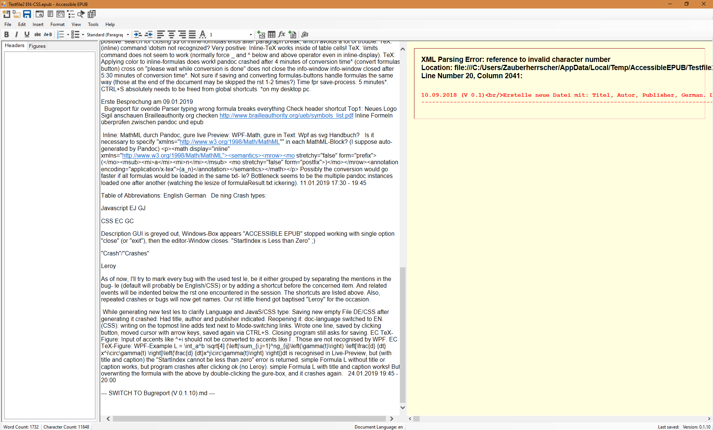
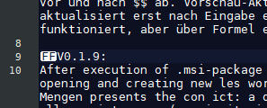
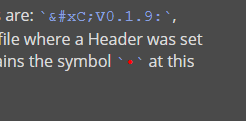

> Erste Besprechung am 09.01.2019


- [x] (A) Bugreport für overide Parser typing wrong formula breaks everything
- [x] (B) Check header shortcut
- [ ] (C) Top1: Neues Logo
- [ ] (D) Sigil anschauen
- [ ] (E) Brailleauthority.org checken http://www.brailleauthority.org/ueb/symbols_list.pdf
- [ ] (F) Inline Formeln überprüfen zwischen pandoc und epub
- [ ] (G) **Inline**: MathML durch Pandoc, **figure live Preview**: WPF-Math, **figure in Text**: Wpf as svg
- [ ] (H) Handbuch?
- [ ] (I) < and > symbols after saving/reopening file. **-> Use \less \greater instead**
- [ ] (T) Liste der TeX-Befehle die aus Blindenversion rausgefiltert werden müssen.
- [ ] (S) Shortcuts need to be listed all at one place, to gain overview and adapt them best. Possible combination with Graphics-list?
- [ ] 


| Table of Abbreviations: | Javascript | CSS  |
| ----------------------- | ---------- | ---- |
| English                 | EJ         | EC   |
| German                  | GJ         | GC   |

|      | Defining Crash types: | Short Description                                            |
| ---- | --------------------- | ------------------------------------------------------------ |
|      | "Crash"/"Crashes"     | GUI is greyed out, Windows-Box appears "ACCESSIBLE EPUB" stopped working with single option "close" (or "exit"), then the editor-Window closes. |
|      | Error Message         | An info-box with red cross opens, reporting an unhandled exception. |
| [x]  | Leroy                 | "StartIndex is Less than Zero" ;)                            |
| [x]  | Leyline               | Editor crashes when modifying an inline-formula in fiiles opened from Win-Explorer, EN-CSS. |
|      | Void                  | Saving a newly created empty file causes an error message.   |
|      |                       | Preview jumps unavoidably to the bottom.                     |

---

#List of features wished for:

- [ ] Pagebreak, with number and STRG+Enter
- [ ] Scroll sync/lock
- [ ] Possibility to load barrier free pictures in the file, that are associated to the normal images and could eventually be printed. (or create "linked" additional-file?) --> See Fragen an SZS
- [ ] Keyboard Shortcut to start rendering of inline formulas? --> See ToDo (S). 
- [ ] Keyboard Shortcut to insert inline-formula (inserts $$ $$ in editor).
- [ ] Possibility to insert text "blocks". For Quotations or coloured/highlighted paragraphs? Already done via indent? Requires feedback.
- [ ] 


---

# V 0.1.10

## Accessible EPUB changelog

### 0.1.10

- Removed bug where the AccessibleEPUB temp folder is not created and therefore an error is shown
- Removed bug where "StartIndex can not be less than 0" is shown. This was due to the element "alttext" being removed when a math formula figure is added, now it has been added again
- Removed the problem with the global saving 
- Resizing of windows is possible below a certain size is now possible
- The file dialogs remember the last directory location
- Removed bug where CSS files opened with the OS's "Open With" command crash

---


> 27.01.2019 16:30 - 19:00 :ballot_box_with_check: 

Installed Version 0.1.10.

Took a look at sigil: (with EC file)

- The behaviour of mode-switching is not as expected. The preview does not render it differently, and the editor jumps to the top. 

- Sigil seems to handle math internally, as switching View-mode starts a "Processing math" process in the preview, followed by a "Typesetting Math" process.
- Sigil does not render the Figure-Formulas in the preview. Displays "<u>[Math Processing Error]</u>" instead. Editor works fine.
- 


Tried som TeX:

- In Testfile EN-CSS: Inserting Linebreak and inline-formula crashes the program.
- File seems to be broken
- Recreating it. -> Works now

Further TeX:

- (EC)(inline) Some commands provided by amsmath are not working, although the package is included in the conversion with pandoc. E.g.: `\dotsm`. Reported in TeX-Limitations.
- Testfile EN-CSS broken again???
- HM-Skript_Css still opens and handles edits correctly.
- <u>Major</u>: (EC) Editing or inserting inline-Formulas crashes the editor. Codename: <u>Leyline</u>


### Major: Leyline

From Windows-Explorer, and with activated automatic refresh preview:

Opening any file with EN-CSS settings works, but as soon as

- click into an inline-formula area
- A formula is added
- ~~some time has passed?~~ 
- adding characters/linebreaks behind a formula.
- SIMPLY ADDING TEXT in a file already containing inline-formulas.

and then, the 

- info-box about deactivated automatic refresh gets closed

The program crashes.


Does not concern Java-Files. Does not concern files empty of inline-formulas before opening.

Bug seems related to the info-box about automatic refresh.


> 29.01.2019 Sachin contacted me, the Leyline-bug seems to be fixed. Tests pending. Changelog above synchronized with the released changelog.

> 29.01.2019 18:00 - 19:10 :ballot_box_with_check:

Began listing required icons for graphical update.

Reinstalled V0.1.10 with actualised installer, in which the Leyline-Bug has been corrected.

- Bug does not seem to appear for Testfile EN-CSS.epub. Well done! :thumbsup:

Exported Logo-sketch to .ico. Will be tested for next release.


> 30.01.2019 19:00 - 20:45 :ballot_box_with_check:

Leyline did not reappear.

(B): Shortcuts for headers are not set. I don't know how I came to believed this last Christmas. Neither on the laptop with the old version, nor on desktop do they work, independently of keyboard configuration.


> 01.02.2019 16:00 - 17:30 :ballot_box_with_check: 

Testing the "import text":

Extracted pages 59-61 from test PDF to import in EC file.

- Have a file open.
- Select "new file"
- Create new file (title, author, publisher, EC)
- clicked "import text". Nothing happens. I leave the file empty and click save.

- <u>Error message:</u> `Value cannot be null. Parameter name: input` 

```
************** Exception Text **************
System.ArgumentNullException: Value cannot be null.
Parameter name: input
   at System.Text.RegularExpressions.Regex.Matches(String input)
   at AccessibleEPUB.Form1.wysiwygToHtml()
   at AccessibleEPUB.Form1.saveFile()
   at AccessibleEPUB.Form1.saveButton_Click(Object sender, EventArgs e)
   at System.Windows.Forms.ToolStripItem.RaiseEvent(Object key, EventArgs e)
   at System.Windows.Forms.ToolStripButton.OnClick(EventArgs e)
   at System.Windows.Forms.ToolStripItem.HandleClick(EventArgs e)
   at System.Windows.Forms.ToolStripItem.HandleMouseUp(MouseEventArgs e)
   at System.Windows.Forms.ToolStripItem.FireEventInteractive(EventArgs e, ToolStripItemEventType met)
   at System.Windows.Forms.ToolStripItem.FireEvent(EventArgs e, ToolStripItemEventType met)
   at System.Windows.Forms.ToolStrip.OnMouseUp(MouseEventArgs mea)
   at System.Windows.Forms.Control.WmMouseUp(Message& m, MouseButtons button, Int32 clicks)
   at System.Windows.Forms.Control.WndProc(Message& m)
   at System.Windows.Forms.ScrollableControl.WndProc(Message& m)
   at System.Windows.Forms.ToolStrip.WndProc(Message& m)
   at System.Windows.Forms.Control.ControlNativeWindow.OnMessage(Message& m)
   at System.Windows.Forms.Control.ControlNativeWindow.WndProc(Message& m)
   at System.Windows.Forms.NativeWindow.Callback(IntPtr hWnd, Int32 msg, IntPtr wparam, IntPtr lparam)

```

- Select `Continue` 
- Program stays stable, I enter a single letter in the editor. Preview gets rendered.
- Save, exit. Select "no" in info-box about saving file before exit.
- reopen file. It is empty. 
- Enter single letter, click save.
- Close, no save-warning.
- Reopen file, content is saved. 

^ The first saving attempt seems not to have worked.

- **Minor:** (EC+GC): An empty line needs to be inserted automatically at the very beginning of the document. For now, it is possible to write in the first line next to the CSS selectors.

Trying above bug again:

- Program start

- Choose "crate new file". Done with title, author, publisher, EC.
- Leave editor empty.
- Click save icon.
- <u>Error Message:</u> Like above.


### [ Bug: Void

Newly created files cannot be saved by clicking the icon or pressing CTRL+S, and cause an error message.

However, they are written on the hard disk and use non-null disk space.

Selecting `continue`does not cause the program to crash.

The empty file can be reopened after this (WinExp), and saved without problems. 

**Solution idea:** Insert a non-deletable empty line by default in new documents to avoid this, which could also solve the problem of users writing in the same line as the CSS selectors are placed.

**]**


Trying text import again, using pdftotext (on windows) preliminarily.

pdftotext does not like the pdf (returns three bold upper arrows). But it likes the exported _Bugreport(V0.1).pdf_ ...

**Update**: the windows powershell stinks.

- (EC) insert exported text into the editor. 
- Preview turns yellow and says:
  XML Parsing Error: reference to invalid character number Location: file:///C:/Users/Zauberherrscher/AppData/Local/Temp/AccessibleEPUB/Testfile2%20EN-CSS/OEBPS/Text/Content.xhtml Line Number 20, Column 2041:
  <u>with red text below corresponding to the source of the whole file.</u>
- The Line+Column number do not correspond to the source txt but to the temp file.
- Screenshot:



- exited without saving the file.

This behaviour is hard to understand. The problematic characters are: `&#xC;V0.1.9:`, more exactly the #. However, this is not the only place in original file where a Header was set with the markdown syntax `# Text`. The extracted .txt file contains the symbol `` at this position. Notepad++ renders it as FF:



And Typora displays it as a red dot in the source view of the markdown document:



This is supposedly an error caused by pdftotext, but could also be created when converting a markdown file to pdf using Typora. Also possible: encoding inconsistency.

> 02.02.2019 17:00 - 18:45

Created Bugreport(V0.1)_cleaned.txt in which the problematic symbols have been removed.

The text cna now be copy/pasted without problems in the editor.


###[ Bug:

The preview jumps back to bottom. Scrolling up only in the preview is not possible. This is independent of the cursor position and takes half a second after releasing the scroll wheel.

**]**

